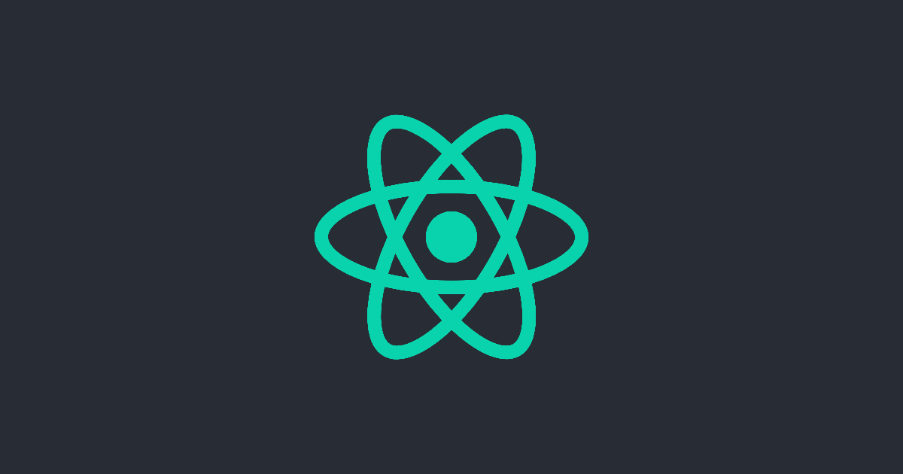

These are the resources used to create the Create React App logo.

## Logo

[Download](https://github.com/facebook/create-react-app/blob/master/docusaurus/website/static/img/logo.svg) |
[Download](https://github.com/facebook/create-react-app/blob/master/docusaurus/website/static/img/favicon/favicon.ico) (Icon) | [Download](https://github.com/facebook/create-react-app/blob/master/docusaurus/website/static/img/logo-og.png) (Large)

## Colors

| Primary                                                            |
| ------------------------------------------------------------------ |
|  `#09D3AC` |

| Dark                                                                                 | Light                                                                                 |
| ------------------------------------------------------------------------------------ | ------------------------------------------------------------------------------------- |
|  `#08BE9B` - Primary Dark    |  `#2EDAB8` - Primary Light    |
|  `#08B392` - Primary Darker  |  `#53E0C5` - Primary Lighter  |
|  `#069478` - Primary Darkest |  `#84E9D6` - Primary Lightest |

| Background                                                         |
| ------------------------------------------------------------------ |
|  `#282c34` |
